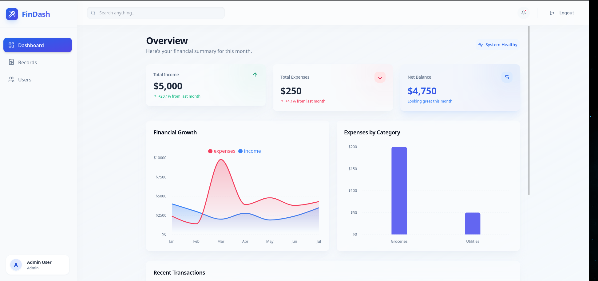
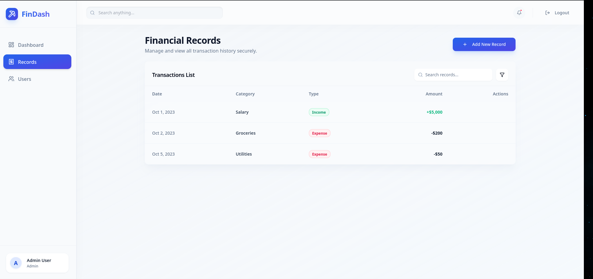
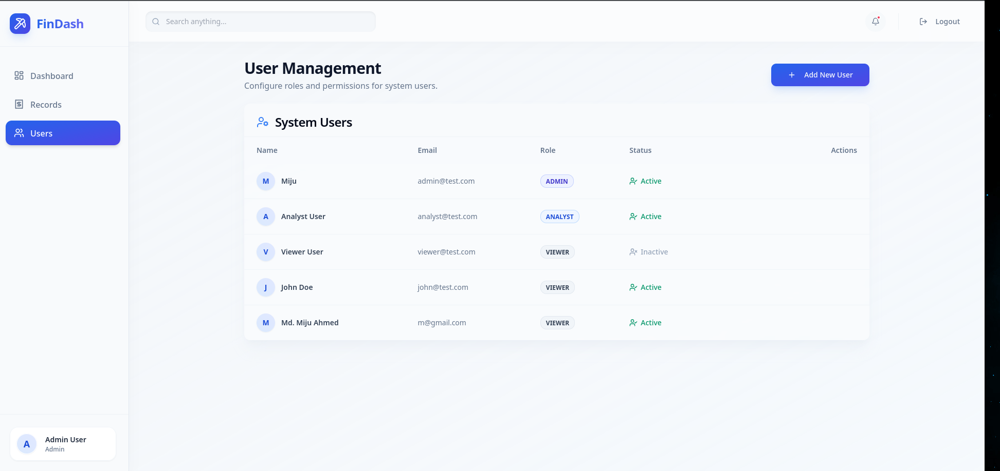

# 💰 Finance Dashboard Backend

A scalable and well-structured backend system for managing financial records, user roles, and dashboard analytics. This project demonstrates real-world backend design with role-based access control (RBAC), data validation, and aggregated insights for a finance dashboard.

---

## 📌 Overview

This system allows different types of users to interact with financial data based on their roles. It provides APIs for managing users, financial records, and generating summary analytics for dashboards.

## 🖼️ Dashboard Preview

<div align="center">
  
  <p><i>Real-time Dashboard Analytics with dynamic charts and metrics.</i></p>
  
  <br/>
  
  
  <p><i>Comprehensive Financial Records Management with search and filtering.</i></p>
  
  <br/>
  
  
  <p><i>Advanced User and Role Management for granular access control.</i></p>
</div>

---

## 🚀 Features

### 1. User & Role Management

- Create and manage users
- Assign roles to users
- Activate/deactivate users
- Role-based access control (RBAC)

#### Supported Roles:
- **Viewer**
  - Can only view dashboard data
- **Analyst**
  - Can view financial records and analytics
- **Admin**
  - Full access (users + records management)

---

### 2. Financial Records Management

Manage financial entries such as income and expenses.

#### Fields:
- Amount
- Type (Income / Expense)
- Category
- Date
- Description/Notes

#### Supported Operations:
- Create records
- Retrieve records
- Update records
- Delete records
- Filter records by:
  - Date range
  - Category
  - Type

---

### 3. Dashboard Summary APIs

Provides aggregated data for dashboard visualization:

- Total Income
- Total Expenses
- Net Balance
- Category-wise totals
- Recent transactions
- Monthly / Weekly trends

---

### 4. Access Control (RBAC)

Strict backend-level access control:

| Role    | Permissions |
|--------|------------|
| Viewer | Read-only access |
| Analyst | Read + analytics |
| Admin  | Full CRUD access |

Implemented using middleware/guards to restrict unauthorized actions.

---

### 5. Validation & Error Handling

- Input validation for all requests
- Proper HTTP status codes
- Meaningful error messages
- Global error handling
- Protection against invalid operations

---

### 6. Data Persistence

- Uses a database for storing users and financial records
- Supports relational or document-based databases
- ORM/ODM used for efficient data handling

---

## 🛠️ Tech Stack

### Frontend
- **Framework**: [Vite](https://vitejs.dev/) + [React 19](https://react.dev/)
- **State Management**: [TanStack Query v5](https://tanstack.com/query/latest) (React Query)
- **Styling**: [Tailwind CSS](https://tailwindcss.com/) + [Shadcn UI](https://ui.shadcn.com/)
- **Animations**: [Framer Motion](https://www.framer.com/motion/)
- **Forms**: [React Hook Form](https://react-hook-form.com/) + [Zod](https://zod.dev/)
- **Icons**: [Lucide React](https://lucide.dev/)

### Backend (System Target)
- **Language**: [Java 21+](https://www.oracle.com/java/)
- **Framework**: [Spring Boot 3.4.4](https://spring.io/projects/spring-boot)
- **Database**: [MySQL](https://www.mysql.com/) / [H2](https://www.h2database.com/) (Dev)
- **Security**: [Spring Security](https://spring.io/projects/spring-security) + [JWT](https://jwt.io/)
- **ORM**: [Spring Data JPA](https://spring.io/projects/spring-data-jpa) (Hibernate)


---

## 📂 Project Structure
src/
├── controllers/ # Handle HTTP requests
├── services/ # Business logic
├── repositories/ # Data access layer
├── models/ # Database models/entities
├── middleware/ # Auth & RBAC logic
├── routes/ # API routes
├── utils/ # Helper functions
├── config/ # Configuration files


---

## 🔐 Authentication

- JWT-based authentication
- Secure login endpoint
- Token required for protected routes

---

## 📡 API Endpoints (Sample)

### Auth
- `POST /api/auth/login` → User login

### Users (Admin Only)
- `POST /api/users` → Create user
- `GET /api/users` → Get all users
- `PUT /api/users/:id` → Update user
- `PATCH /api/users/:id/status` → Activate/Deactivate

### Financial Records
- `POST /api/records` → Create record (Admin)
- `GET /api/records` → Get records (All roles)
- `GET /api/records/:id` → Get single record
- `PUT /api/records/:id` → Update record (Admin)
- `DELETE /api/records/:id` → Delete record (Admin)

### Dashboard
- `GET /api/dashboard/summary` → Overview stats
- `GET /api/dashboard/trends` → Monthly trends
- `GET /api/dashboard/categories` → Category breakdown

---

## 📊 Example Response

```json
{
  "totalIncome": 5000,
  "totalExpenses": 3000,
  "netBalance": 2000,
  "categories": [
    { "name": "Food", "amount": 1000 },
    { "name": "Transport", "amount": 500 }
  ]
}


